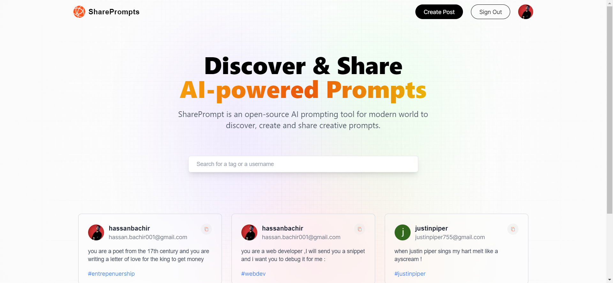
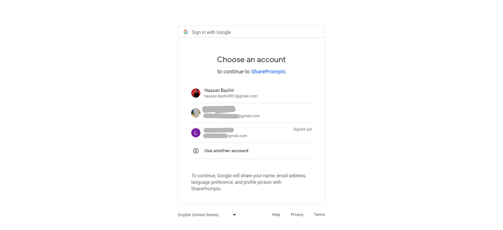
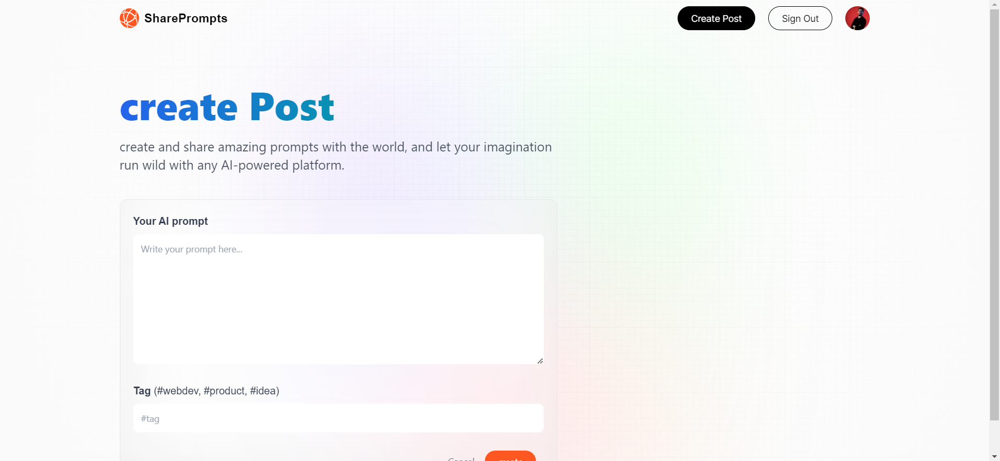
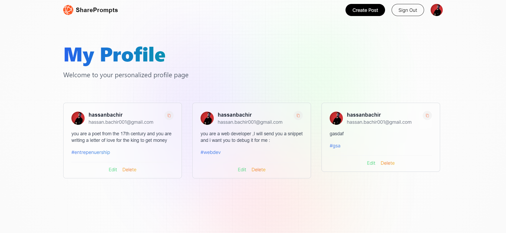
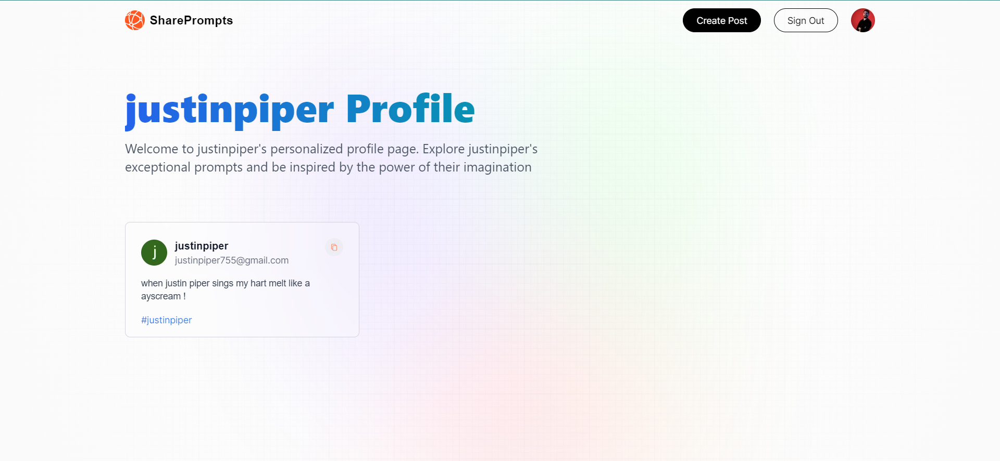
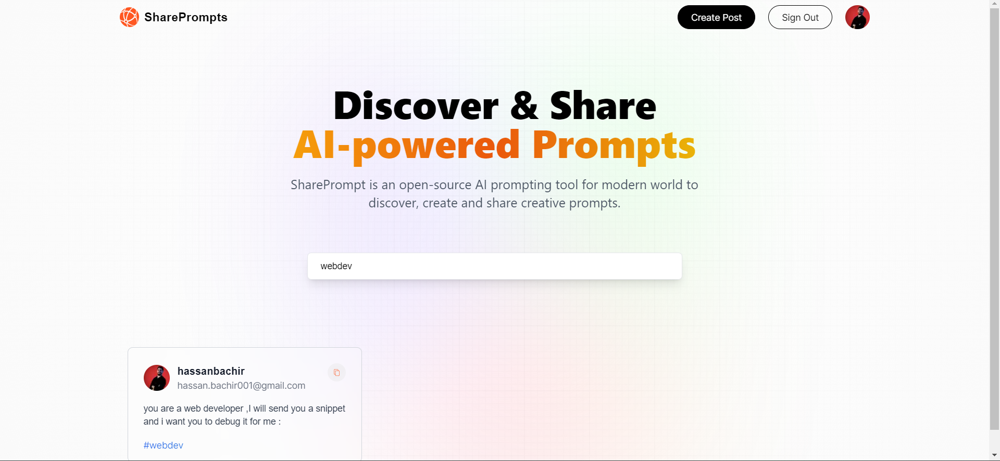
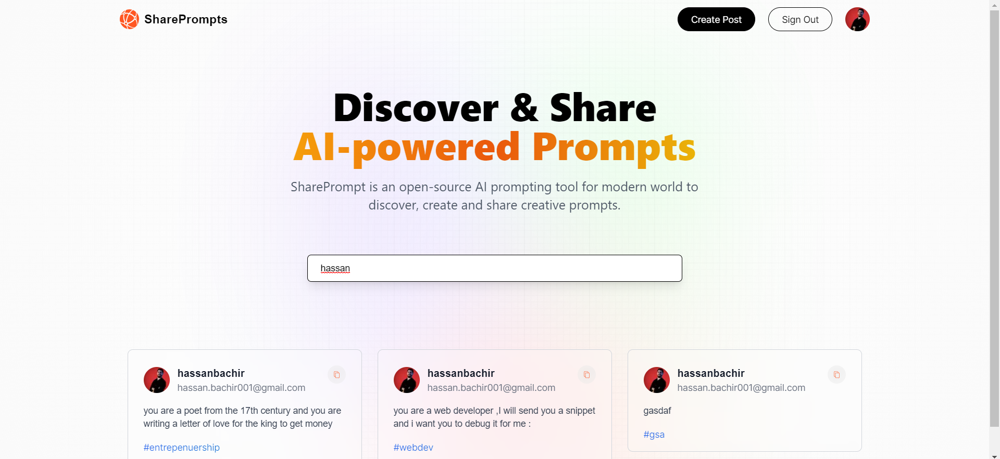
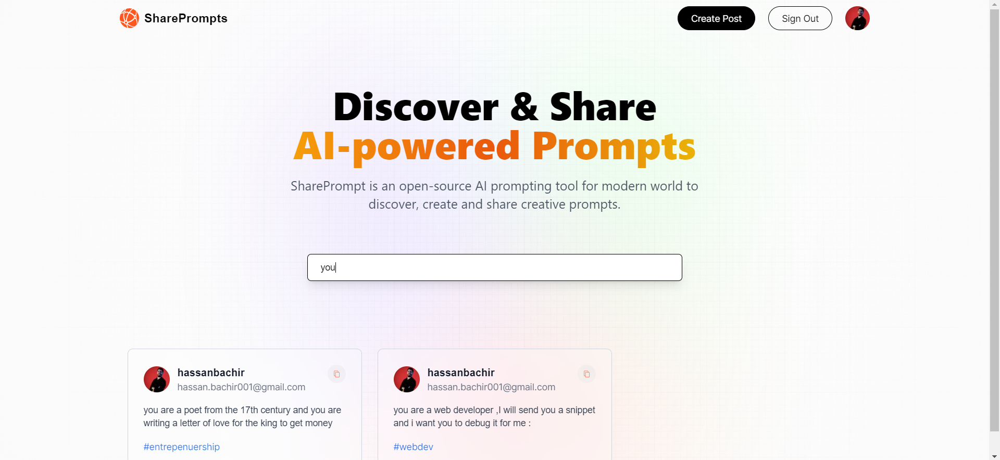

  

<!-- project philosophy -->

> The project philosophy is creating a simple app that utilize tools and frameworks like Next.js, MongoDB, and Google services with Next auth to create a handy prompts sharing platform
>
> This app aims to make it simple and convenient for individuals to use the AI chatbots in the most efficient by avoiding writing redundant prompts, just search for the suitable tag and thats it !

### User Stories

1. User Registration and Authentication 
   As a new user, I want to sign up using my Google account. 
   As a registered user, I want to log in using my Google account. 
2. Prompt Creation and Editing 
   As a user, I want to create new AI prompts and share them. 
   As a user, I want to edit or update the prompts I've created. 
3. Prompt Viewing and Interaction 
   As a user, I want to view AI prompts created by others. 
   As a user, I want to upvote or downvote prompts to express my opinion. 
4. Prompt Searching and Filtering 
   As a user, I want to search for prompts by keywords or phrases. 
   As a user, I want to filter prompts by tags or categories. 
5. User Profile Management 
   As a user, I want to view and edit my profile information. 
   As a user, I want to upload or change my profile picture. 

  

<!-- Implementation -->

> Using the wireframes and mockups as a guide, I implemented the SharePrompts app with the following features:

### User Screens
| Welcome                                       |
| --------------------------------------------- |
|  |

| Google SignIn                                      |
| -------------------------------------------- |
|  |

| Create Prompt                                     |
| ------------------------------------------- |
|  |

| Profile                                      |
| -------------------------------------------- |
|      |

| Other's profile                                     |
| ------------------------------------------- |
|     |

| Search by Tag                                      |
| -------------------------------------------- |
|   |

| Search by User                                      |
| ------------------------------------------- |
|  |

| Search by Text                                      |
| -------------------------------------------- |
|  |

  

<!-- Tech stack -->

### Wallii is built using the following technologies:

-   🚨 SharePrompts was built using Next.js for both the Front-end and the Back-end.
-   For the interface Tailw
-   The app features custom animations and transitions to enhance the user experience and make it feel more fluid and natural.
-   To facilitate seamless communication between the frontend and backend, the app uses RESTful APIs and JSON data exchange formats.
-   Wallii offers robust security features to protect user data and ensure the privacy of their information.
-   The app features a powerful search functionality that allows users to easily find what they're looking for within the app's content.
-   Wallii offers a range of customization options, allowing users to personalize their experience and tailor the app to their preferences.
